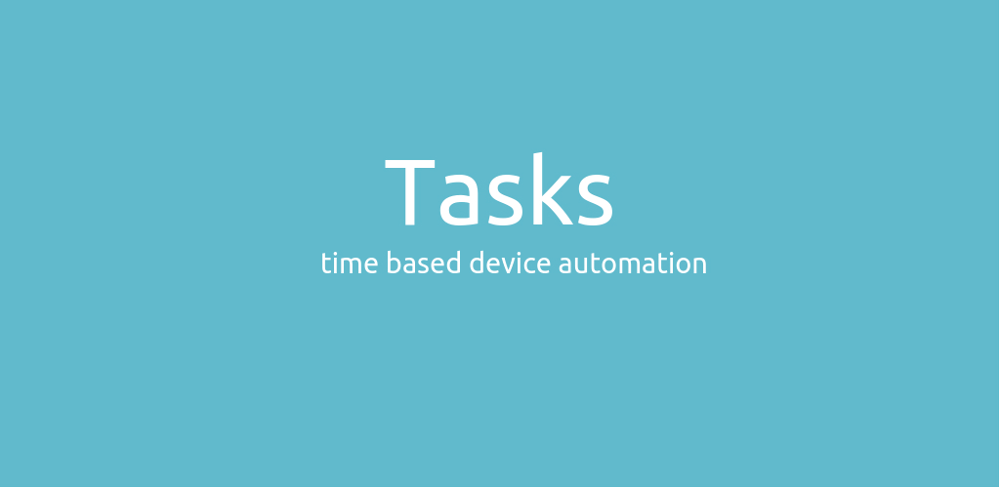
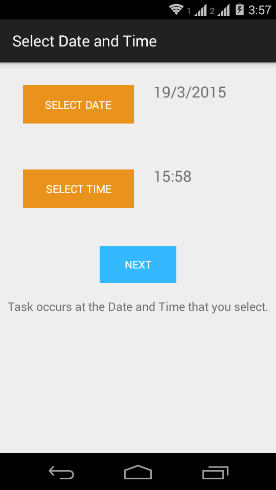
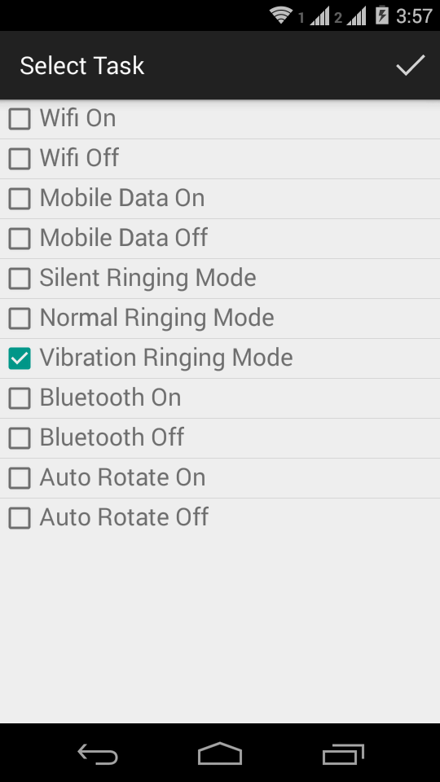
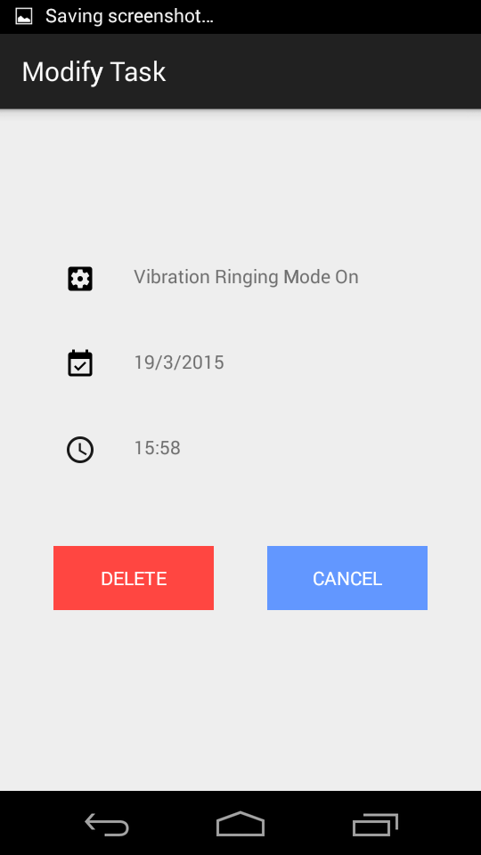

Time based Device Automation

Now, schedule your task on your preferred date and time. Task will be executed on the date and time that you select.

Some task present in the app are:
* WiFi On / Off
* Bluetooth On / Off
* Silent / Normal / Vibration Ringing Mode

etc.

More task support coming soon.

## Screenshots

### Home Screen (Empty, Single Task and Multiple Task)

### Select Date and Time

### Select Task (Multiple Tasks can also be selected at once)

### Edit Task

